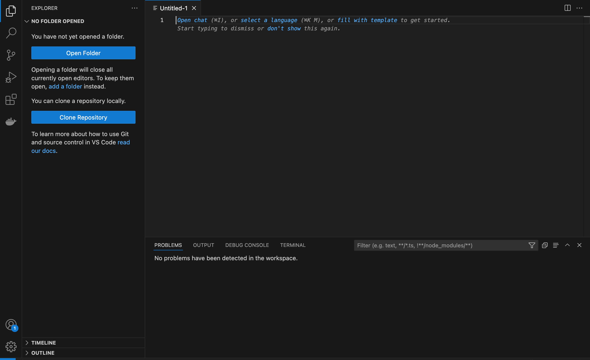
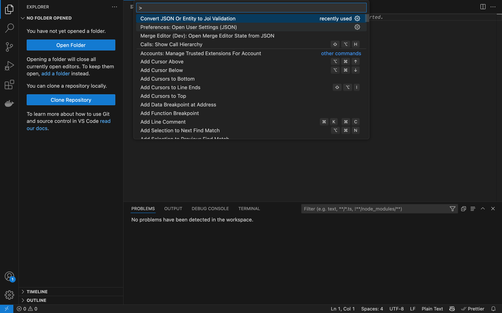
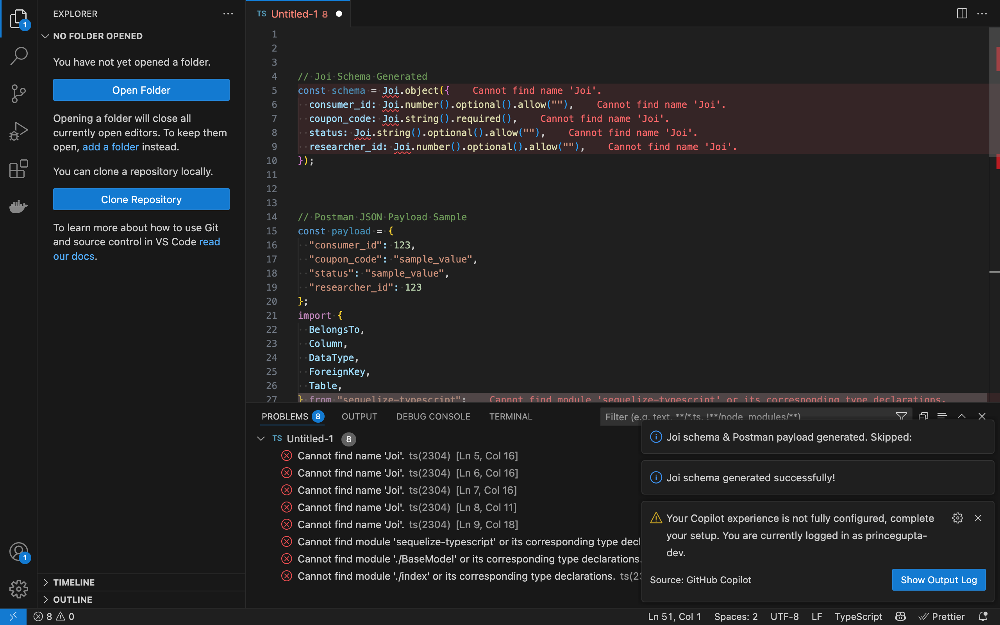

# Joi Schema and Postman payload JSON Generator

This Visual Studio Code extension allows you to convert sequelize-typescript models into Joi validation schemas along with Postman sample payloads.

## Features

- Converts Sequelize-style models to Joi schema.
- Skips fields like `id`, `created_at`, `updated_at`, `deleted_at`, etc.
- Automatically generates a sample payload for Postman.
- Automatically detects types and applies validation (email, date, URL, etc.)

## Screenshot

- Open your model file or new text file.



- Run the `Convert JSON to Joi` command from the Command Palette or press **Ctrl+Shift+P**.



- Joi schema and Postman sample will be inserted at the top of your file.



## Usage

1. Open your model file.
2. Run the `Convert JSON to Joi` command from the Command Palette or press **Ctrl+Shift+P**.
3. Joi schema and Postman sample will be inserted at the top of your file.

## Requirements

No additional setup required.

## 📤 Output Example

```ts
// Joi Schema Generated
const schema = Joi.object({
  name: Joi.string().required(),
  age: Joi.number().optional(),
  email: Joi.string().email().required(),
});

// Postman JSON Payload Sample
const payload = {
  "name": "sample_value",
  "age": 123,
  "email": "example@example.com"
};

---

Made with ❤️ by Prince Gupta.
```
